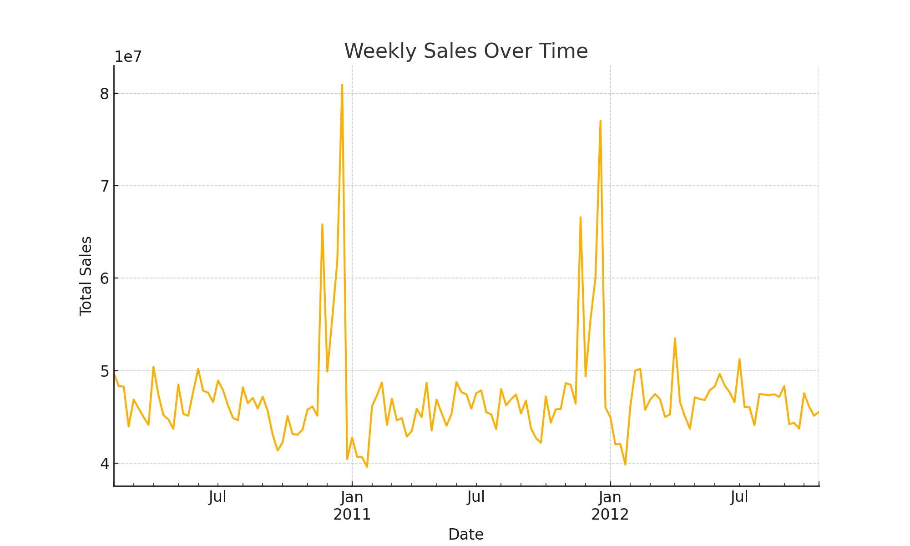
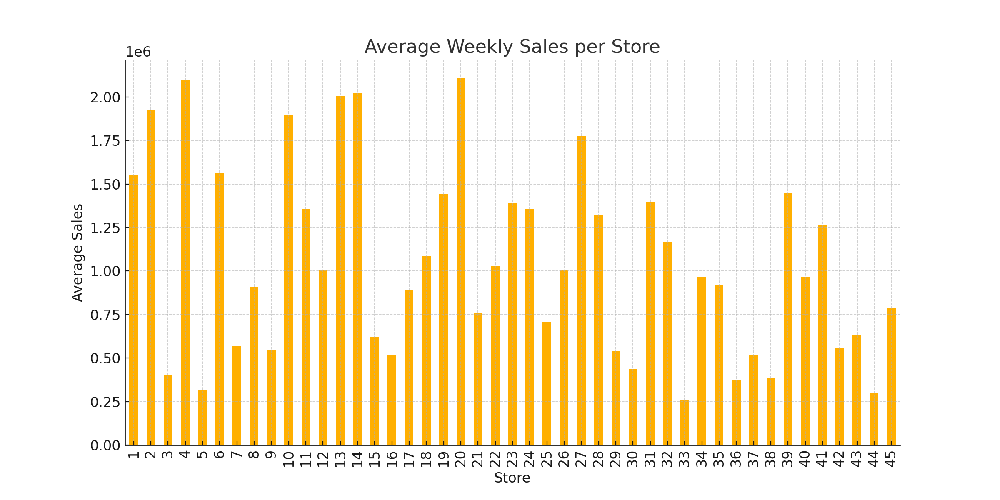
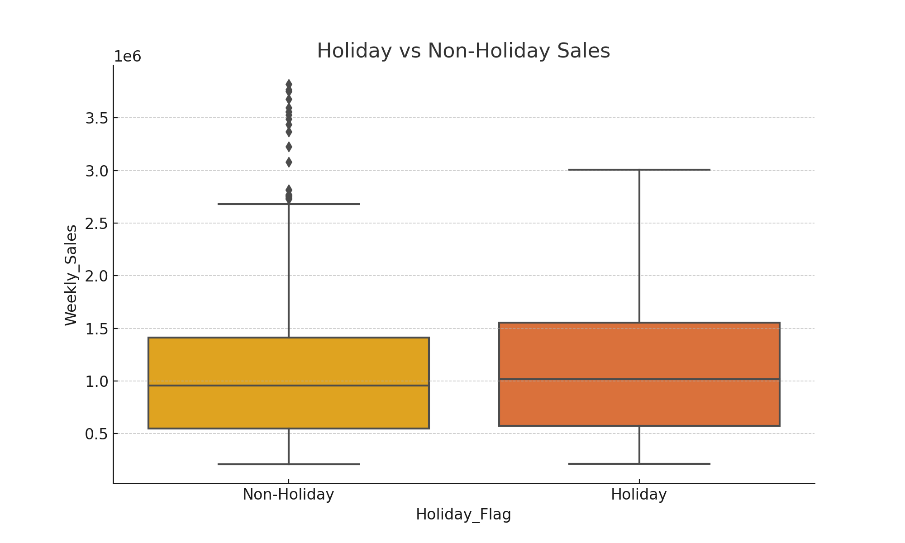

# 🛍️ Walmart Weekly Sales Predictor

This is an interactive Streamlit web app and data science project that predicts weekly sales for Walmart stores based on key features such as temperature, fuel price, CPI, unemployment rate, and holiday flags. It includes end-to-end data analysis, visualization, machine learning, and a live app interface.

## 📊 Features

- Exploratory Data Analysis (EDA) using Jupyter Notebooks
- Machine Learning model using Random Forest Regressor
- Weekly Sales prediction based on user inputs
- Interactive charts (sales trend, store performance, holiday comparison)
- Deployed Streamlit web application

## 🧠 Technologies Used

- Python
- pandas, numpy
- scikit-learn
- matplotlib, seaborn
- Streamlit

## 🚀 How to Run Locally

1. Clone the repository:

```bash
git clone https://github.com/mep3175/walmart-sales-app.git
cd walmart-sales-app
```

2. Install the required libraries:

```bash
pip install -r requirements.txt
```

3. Run the Streamlit app:

```bash
streamlit run streamlit_app.py
```

## 🌐 Live App

You can access the live deployed app here:  
👉 [Streamlit App](https://walmart-sales-app-gb4svtzvacdrdfmsxahryc.streamlit.app/) 

## 📁 Project Structure

```
.
├── Walmart_Sales.csv
├── streamlit_app.py
├── rf_model.pkl
├── Walmart_Sales_Analysis.ipynb
├── Walmart_Sales_Regression_Model.ipynb
├── retrain_model.py
└── requirements.txt
```

## ✨ Screenshots


#### 🔮 Streamlit App Interface


#### 📊 Average Sales per Store


#### 📦 Holiday vs Non-Holiday Sales Boxplot


#### 🔥 Correlation Heatmap


## 👨‍💻 Author

**Meet Patel**  
Master's in Engineering and Management  
TH Ingolstadt  
GitHub: [mep3175](https://github.com/mep3175)

---

> Feel free to fork this repo, contribute, or connect with me on [LinkedIn](https://linkedin.com).
